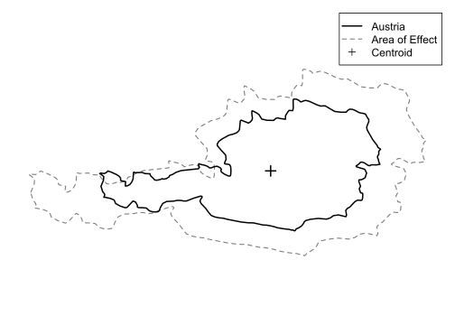

# areaOfEffect

[](https://github.com/gcol33/areaOfEffect/actions/workflows/R-CMD-check.yml)
[](https://opensource.org/licenses/MIT)

**Spatial Support at Scale**

Given a set of points and one or more support polygons, `aoe()` classifies points as "core" (inside original support) or "halo" (inside the area of effect but outside original support), pruning all points outside.

<p align="center">
  
</p>

## Quick Start

```r
library(areaOfEffect)

# Austria
result <- aoe(pts, "AT")

# Austria + Germany
result <- aoe(pts, c("AT", "DE"))

# Auto-detect countries from points
result <- aoe(pts)
```

## Statement of Need

Political borders are not hard ecological boundaries. Biological processes do not stop at administrative lines. When sampling within a political region, observations near the border are influenced by conditions outside that region.

The **area of effect** (AoE) corrects for this border truncation by expanding the support outward from its centroid. Points are then classified:

- **Core**: inside the original support
- **Halo**: outside the original support but inside the expanded area of effect
- **Pruned**: outside the area of effect (not returned)

By default, the AoE expands to give **equal core and halo areas**.

Sea boundaries are hard boundaries. An optional mask can enforce such constraints.

## Features

- **Country lookup**: Pass ISO codes or names directly (`"AT"`, `"Austria"`)
- **Auto-detection**: Omit support to detect countries from points
- **Multiple supports**: Process admin regions with long format output
- **Masking**: Coastlines and other hard constraints
- **S3 methods**: `print()`, `summary()`, `plot()`
- **Diagnostics**: `aoe_summary()`, `aoe_area()`, `aoe_geometry()`

## Installation

```r
# Install from GitHub
# install.packages("pak")
pak::pak("gcol33/areaOfEffect")
```

## Usage Examples

### Single Support

```r
library(areaOfEffect)
library(sf)

# Create example support polygon
support <- st_as_sf(
  data.frame(id = 1),
  geometry = st_sfc(st_polygon(list(
    cbind(c(0, 100, 100, 0, 0), c(0, 0, 100, 100, 0))
  ))),
  crs = 32631
)

# Create observation points
pts <- st_as_sf(
  data.frame(id = 1:4),
  geometry = st_sfc(
    st_point(c(50, 50)),   # core
    st_point(c(10, 10)),   # core
    st_point(c(150, 50)),  # halo
    st_point(c(300, 300))  # pruned
  ),
  crs = 32631
)

result <- aoe(pts, support)
result$aoe_class
#> [1] "core" "core" "halo"
```

### Multiple Supports

```r
supports <- st_as_sf(
  data.frame(region = c("A", "B")),
  geometry = st_sfc(
    st_polygon(list(cbind(c(0, 50, 50, 0, 0), c(0, 0, 100, 100, 0)))),
    st_polygon(list(cbind(c(50, 100, 100, 50, 50), c(0, 0, 100, 100, 0))))
  ),
  crs = 32631
)

result <- aoe(pts, supports)
# Points may appear in both regions' output
```

### With Mask

```r
land <- st_as_sf(
  data.frame(id = 1),
  geometry = st_sfc(st_polygon(list(
    cbind(c(-50, 200, 200, -50, -50), c(0, 0, 150, 150, 0))
  ))),
  crs = 32631
)

result <- aoe(pts, support, mask = land)
```

### Diagnostics

```r
aoe_summary(result)
#>   support_id n_total n_core n_halo prop_core prop_halo
#> 1          1       3      2      1     0.667     0.333
```

## Scale

Default: `sqrt(2) - 1`, which gives equal core and halo areas.

| Scale | Multiplier | Area Ratio |
|-------|------------|------------|
| **sqrt(2) - 1** (default) | **1.414** | **1:1** |
| 1 | 2 | 1:3 |

## Documentation

- [Quick Start](https://gillescolling.com/areaOfEffect/articles/quickstart.html)
- [Theory](https://gillescolling.com/areaOfEffect/articles/theory.html)

## Support

> "Software is like sex: it's better when it's free." - Linus Torvalds

I'm a PhD student who builds R packages in my free time because I believe good tools should be free and open. I started these projects for my own work and figured others might find them useful too.

If this package saved you some time, buying me a coffee is a nice way to say thanks. It helps with my coffee addiction.

[](https://buymeacoffee.com/gcol33)

## License

MIT

## Citation

```bibtex
@software{areaOfEffect,
  author = {Colling, Gilles},
  title = {areaOfEffect: Spatial Support at Scale},
  year = {2025},
  url = {https://github.com/gcol33/areaOfEffect}
}
```
