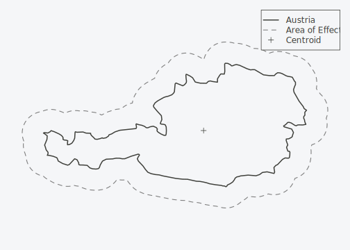
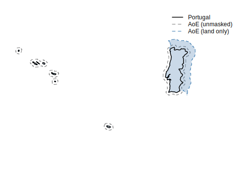

# areaOfEffect

> Small exact engines for scientific computing in R.

*the area a point actually affects*

[](https://CRAN.R-project.org/package=areaOfEffect)
[](https://cran.r-project.org/package=areaOfEffect)
[](https://cran.r-project.org/package=areaOfEffect)
[](https://github.com/gcol33/areaOfEffect/actions/workflows/R-CMD-check.yml)
[](https://app.codecov.io/gh/gcol33/areaOfEffect)
[](https://opensource.org/licenses/MIT)

**Classify points as inside, near, or too far from a polygon boundary, with a buffer width that picks itself.**

Give it points and a region. `areaOfEffect` labels each point **core** (inside),
**halo** (in the buffer zone), or prunes it (too far), and it sizes the buffer for
you: the default produces equal core and halo areas, a scale-free definition of
"near the boundary" that means the same thing for Luxembourg and Brazil. Projection,
buffering, and point-in-polygon are handled through `sf` under one call.

```r
library(areaOfEffect)

observations <- data.frame(
  id  = c("A", "B", "C", "D"),
  lon = c(14.5, 15.2, 16.8, 20.0),
  lat = c(47.5, 48.1, 47.2, 48.5)
)

# classify relative to Austria
result <- aoe(observations, "Austria")
result$aoe_class
#> [1] "core" "core" "halo"
# (point D is pruned: outside the buffer zone)
```

<p align="center">
  
</p>

## A buffer width you don't have to guess

The underlying `sf` workflow is well known: load a boundary, fix the CRS,
`st_buffer()`, `st_intersects()`. The repetitive part is one function call. The
harder part is the buffer distance. A 10 km buffer is most of Luxembourg and a
rounding error for Brazil, so a fixed distance is not comparable across regions.

`areaOfEffect` solves for the distance instead of asking you to invent one. The
default scale `sqrt(2) - 1` is the unique value that makes the halo area equal the
core area: it is the solution of `(1 + s)^2 - 1 = 1`, not a tuned constant. So "near
the boundary" is defined by the geometry of the region, the same way everywhere.

```r
library(sf)

# the hand-rolled version: you choose 10000 and hope it travels
buf <- st_buffer(st_geometry(austria), 10000)
near <- lengths(st_intersects(pts, st_difference(buf, austria))) > 0

# the equal-area version: the width is whatever makes core area == halo area
aoe(pts, "Austria")
```

## What's in the box

- **`aoe()`**: classify points as core, halo, or pruned against one or more
  supports. Pass a data frame with coordinates or an `sf` object; pass a country
  name (`"Austria"`, `"AT"`), your own polygon, or nothing (countries are detected
  from the points).
- **`aoe_border()`**: classify points by side and distance from a line, with
  symmetric equal-area zones on each side (for example, either side of an
  international border).
- **`aoe_expand()`**: grow the buffer per support just enough to capture a minimum
  point count, under hard caps on area and distance.
- **`aoe_sample()`**: stratified sampling of a result by core/halo or by side, for
  balanced draws when one class dominates.
- **`aoe_summary()`, `aoe_area()`, `aoe_geometry()`**: counts and proportions per
  support, area statistics (halo:core ratio, masking effect), and the underlying
  AoE polygons for plotting.

## Solving for area after masking

The default equal-area buffer extends into anything around the region, including
ocean. For terrestrial data that area is wasted. The `mask` argument clips the halo
to relevant areas, and the `area` argument then solves for the buffer that hits your
target *after* clipping, so equal-area still holds on the land that remains.

<p align="center">
  
</p>

```r
# clip the halo to land using the bundled Natural Earth polygon
aoe(df, "Portugal", mask = "land")

# equal land area in core and halo, even where half the buffer would be sea
aoe(df, "Japan", mask = "land", area = 1)
```

Without a mask the equal-area scale is analytic and exact. With one, the masked area
has no closed form, so the buffer is found by a short secant search that converges in
a handful of clipping evaluations.

## Scale

The `scale` argument sets halo size as a proportion of core area. The default,
`sqrt(2) - 1` (about 0.414), gives a 1:1 halo:core ratio.

| Scale | Halo:Core area |
|-------|----------------|
| `sqrt(2) - 1` (default) | 1:1 |
| `0.5` | 1.25:1 |
| `1` | 3:1 |

## Installation

```r
install.packages("areaOfEffect")        # CRAN

install.packages("pak")                  # development version
pak::pak("gcol33/areaOfEffect")
```

## Documentation

- [Quick Start](https://gillescolling.com/areaOfEffect/articles/quickstart.html)
- [Theory](https://gillescolling.com/areaOfEffect/articles/theory.html)
- [Function Reference](https://gillescolling.com/areaOfEffect/reference/index.html)

## Support

> "Software is like sex: it's better when it's free." — Linus Torvalds

I'm a PhD student who builds R packages in my free time because I believe good tools
should be free and open. I started these projects for my own work and figured others
might find them useful too.

If this package saved you some time, buying me a coffee is a nice way to say thanks.
It helps with my coffee addiction.

[](https://buymeacoffee.com/gcol33)

## License

MIT (see the LICENSE.md file)

## Citation

```bibtex
@software{areaOfEffect,
  author = {Colling, Gilles},
  title  = {areaOfEffect: Classify Points by Distance to Polygon Boundaries},
  year   = {2025},
  url    = {https://CRAN.R-project.org/package=areaOfEffect},
  doi    = {10.32614/CRAN.package.areaOfEffect}
}
```
</content>
</invoke>
